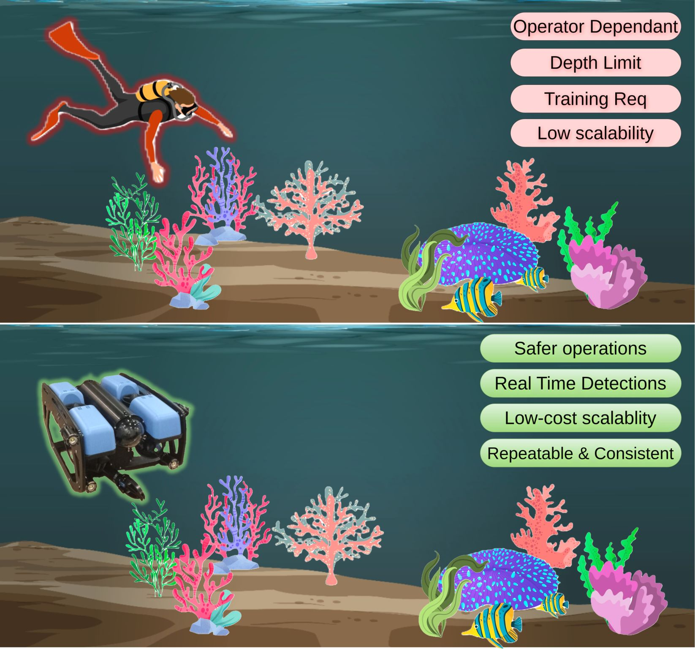
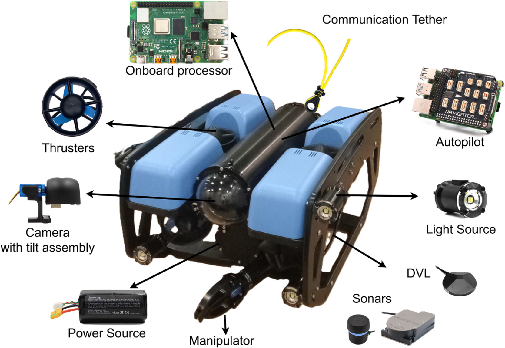
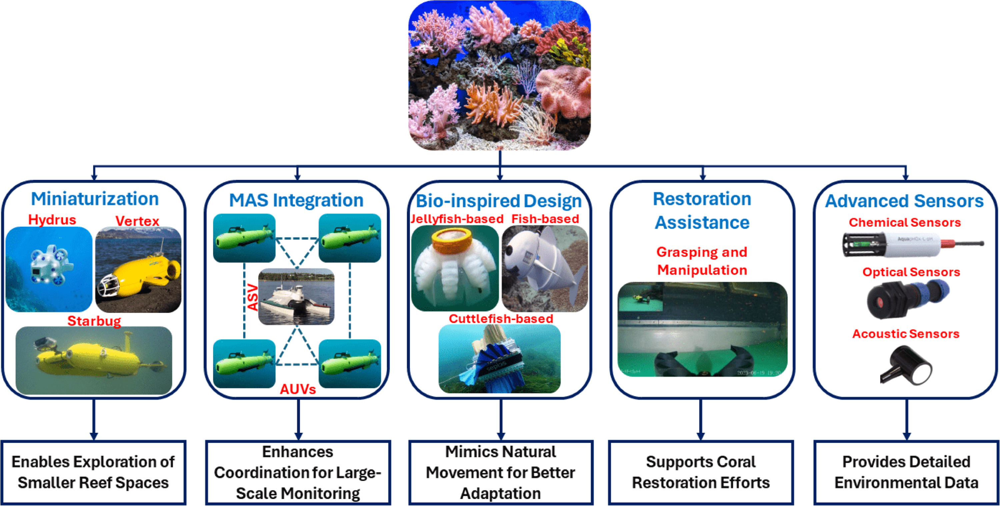

<h1 align="center">
  Autonomous Robotic Systems for Coral Reef Monitoring<br>
  <small>Review and Open Research Issues</small>
</h1>

<div align="center">
  <a href="#">Atif Sultan</a> &nbsp;•&nbsp;
  <a href="#">Lyes Saad Saoud</a> &nbsp;•&nbsp;
  <a href="#">Mahmoud Elmezain</a> &nbsp;•&nbsp;
  <a href="#">Mohamed Heshmat</a> &nbsp;•&nbsp;
  <br/>
  <a href="#">Lakmal Seneviratne</a> &nbsp;•&nbsp;
  <a href="https://scholar.google.com/citations?user=bCC3kdUAAAAJ&hl=en">Irfan Hussain</a>
</div>

<h4 align="center">
  <a href="https://doi.org/10.1016/j.ecoinf.2025.103511"><b>Paper (Elsevier / ScienceDirect)</b></a>
</h4>

---

## 📄 Paper Information

**Autonomous robotic systems for coral reef monitoring: Review and open research issues**  
Atif Sultan, Lyes Saad Saoud, Mahmoud Elmezain, Mohamed Heshmat,  
Lakmal Seneviratne, Irfan Hussain  

*Ecological Informatics*, 92 (2025), 103511  
**DOI:** https://doi.org/10.1016/j.ecoinf.2025.103511  

👉 **ScienceDirect:**  
https://www.sciencedirect.com/science/article/pii/S1574954125005205

---

## 🧠 Abstract

Coral reefs are among the most biodiverse ecosystems on Earth, yet they face increasing threats from climate change, pollution, and anthropogenic activities. Conventional coral reef monitoring approaches—such as diver-based visual surveys—are constrained by limited spatial coverage, safety risks, observer bias, and low repeatability.

This review examines how **Autonomous Underwater Vehicles (AUVs)** and robotic systems are reshaping coral reef monitoring by enabling **systematic, scalable, and non-invasive data collection**. The paper surveys advances in robotic platforms, visual sensing, artificial intelligence, and autonomous decision-making, with emphasis on applications such as coral health assessment, bleaching detection, biodiversity monitoring, and three-dimensional reef mapping. Open challenges and future research directions are identified to guide the next generation of robotic coral reef monitoring systems.

---

## 🎯 Scope and Structure of the Review

The review focuses on **vision-based AUV systems for coral reef monitoring**, covering:

- Ecological motivations for robotic reef monitoring  
- Limitations of conventional diver-based approaches  
- AUV platforms, navigation, and sensing technologies  
- Computer vision and AI for coral analysis  
- Applications in coral health assessment and reef mapping  
- Ethical, ecological, and operational challenges  
- Open research directions  

---

## 🌊 Motivation for Robotic Coral Reef Monitoring  


Conventional coral reef monitoring methods, including diver-based surveys and manual visual assessments, have long served as the foundation of reef ecology studies. However, these approaches are inherently limited by diver endurance, depth constraints, safety risks, and observer variability. As coral reefs continue to degrade at accelerating rates, there is an urgent need for **scalable, repeatable, and high-resolution monitoring solutions**.

Figure 1 illustrates the fundamental contrast between traditional monitoring methods and automated, robotic approaches. While conventional methods offer detailed local observations, they struggle to scale across large or remote reef systems. In contrast, robotic platforms—particularly AUVs—enable continuous, objective, and high-throughput data collection.



**Figure 1.** *Conceptual comparison between conventional coral reef monitoring methods and autonomous robotic approaches. The figure highlights key limitations of diver-based surveys and the advantages of AUV-enabled monitoring in terms of scalability, safety, consistency, and data quality.*

---

## 🤖 Autonomous Underwater Vehicles for Reef Monitoring  

Autonomous Underwater Vehicles form the technological backbone of modern robotic reef monitoring. Equipped with cameras, lighting systems, navigation sensors, and onboard processors, AUVs can operate independently in complex and hazardous underwater environments. Their ability to follow pre-programmed trajectories and revisit precise locations enables consistent long-term monitoring of reef health.

Figure 2 presents representative AUV platforms and system configurations used for coral reef inspection. These systems integrate visual sensing with autonomy and control algorithms, allowing robots to collect high-resolution imagery while minimizing ecological disturbance.



**Figure 2.** *Examples of Autonomous Underwater Vehicles equipped with visual sensors and onboard intelligence for systematic coral reef monitoring, including imaging, navigation, and environmental data acquisition.*

---

## 🪸 Applications of Robotic Coral Reef Monitoring  


Beyond data collection, robotic systems enable advanced analysis of coral reef ecosystems through the integration of computer vision and artificial intelligence. Automated techniques can detect coral colonies, classify species, assess bleaching severity, and reconstruct three-dimensional reef structures from visual data. Such capabilities significantly reduce reliance on manual annotation while improving consistency and scalability across monitoring campaigns.


---

---

## 🔮 Future Directions in Robotic Coral Reef Monitoring  
*(Paper Future Outlook / Directions Figure)*

Despite rapid progress in autonomous robotic systems for coral reef monitoring, several open challenges and research opportunities remain. Addressing these challenges is essential for transitioning robotic monitoring systems from experimental deployments to large-scale, long-term conservation tools.

One key direction is the development of **robust autonomy in complex reef environments**. Coral reefs are highly unstructured, dynamic, and visually cluttered, posing significant challenges for reliable navigation, obstacle avoidance, and long-term localization. Future AUVs must incorporate improved sensor fusion, adaptive planning, and learning-based navigation strategies to operate safely and efficiently in such environments.

Another important research direction lies in **advanced AI-driven analysis**. While current computer vision models demonstrate promising performance in coral detection and classification, their robustness under varying illumination, turbidity, and biological diversity remains limited. Future work should focus on domain adaptation, self-supervised learning, and multimodal fusion to improve generalization across different reef systems and environmental conditions.

**Real-time onboard processing and decision-making** also represent a critical frontier. Enabling AUVs to process visual and environmental data in situ would allow adaptive mission planning, early detection of bleaching or disease events, and targeted data collection, reducing reliance on post-mission analysis.

From an ecological perspective, future research must consider the **long-term environmental impact and ethical deployment** of robotic platforms. This includes minimizing physical disturbance to reef structures, understanding behavioral responses of marine organisms to robots, and establishing best practices for sustainable robotic monitoring.

Finally, the lack of **standardized datasets, benchmarks, and evaluation protocols** remains a major barrier to progress. Establishing shared datasets and performance metrics would enable fair comparison of methods, accelerate algorithmic development, and promote reproducibility across the research community.

Figure 3 summarizes the key future directions and open research challenges discussed in this review, highlighting the interdisciplinary nature of advancing robotic coral reef monitoring.



**Figure 3.** *Overview of future research directions in robotic coral reef monitoring, including advancements in autonomy, AI-driven percepti*
---

## 🚧 Open Challenges and Research Directions

Despite significant progress, several challenges remain. These include reliable underwater navigation in visually complex environments, robustness of AI models under varying lighting and turbidity conditions, ecological impacts of long-term robotic deployment, and the lack of standardized benchmarking datasets. Addressing these challenges will be critical to fully realizing the potential of robotic systems for coral reef conservation.

---

## 🏛️ Acknowledgements

This publication is based upon work supported by the  
**Khalifa University Center for Autonomous Robotic Systems (KUCARS)**,  
Khalifa University of Science and Technology.

---

## 📚 BibTeX

```bibtex
@article{sultan2025autonomous,
  title={Autonomous robotic systems for coral reef monitoring: Review and open research issues},
  author={Sultan, Atif and Saad Saoud, Lyes and Elmezain, Mahmoud and Heshmat, Mohamed and Seneviratne, Lakmal and Hussain, Irfan},
  journal={Ecological Informatics},
  volume={92},
  pages={103511},
  year={2025},
  publisher={Elsevier},
  doi={10.1016/j.ecoinf.2025.103511}
}
